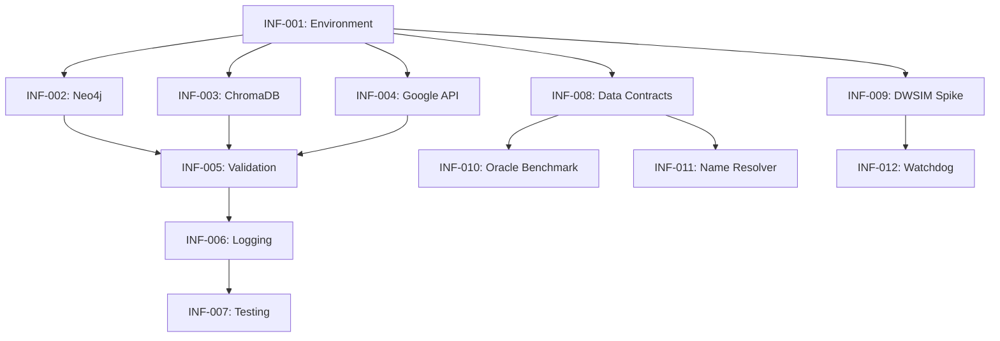

# 🏗️ Infrastructure Backlog

## Overview
Core infrastructure setup including configuration, database connections, and shared utilities.

---

## Tasks

### INF-001: Environment Setup
**Priority**: 🔴 Critical | **Estimate**: 2h | **Status**: ⬜ Not Started

**Description**: Set up Python environment with all dependencies

**Acceptance Criteria**:
- [ ] Python 3.11+ virtual environment created
- [ ] All dependencies from pyproject.toml installed
- [ ] RDKit installed via conda
- [ ] PyTorch with CUDA support (if GPU available)

**Implementation Notes**:
```bash
# Create conda environment
conda create -n entrainer python=3.11
conda activate entrainer

# Install RDKit (must be via conda)
conda install -c conda-forge rdkit

# Install project dependencies
pip install -e ".[dev]"
```

---

### INF-002: Neo4j Setup
**Priority**: 🔴 Critical | **Estimate**: 1h | **Status**: ⬜ Not Started

**Description**: Install and configure Neo4j Community Edition

**Acceptance Criteria**:
- [ ] Neo4j Community Edition installed
- [ ] Database created and accessible
- [ ] Connection tested from Python
- [ ] Credentials stored in .env

**Implementation Notes**:
- Download from https://neo4j.com/download/
- Windows: Use installer, default port 7687
- Create database named "entrainer"
- Test with: `neo4j.run_query("RETURN 1")`

---

### INF-003: ChromaDB Setup
**Priority**: 🔴 Critical | **Estimate**: 30m | **Status**: ⬜ Not Started

**Description**: Configure ChromaDB persistent storage

**Acceptance Criteria**:
- [ ] ChromaDB directory created
- [ ] Collection created and accessible
- [ ] Embedding model configured

**Implementation Notes**:
- Uses local persistent storage (no server needed)
- Default path: `./data/chromadb`
- Test with health_check() method

---

### INF-004: Google API Configuration
**Priority**: 🔴 Critical | **Estimate**: 30m | **Status**: ⬜ Not Started

**Description**: Configure Gemini API access

**Acceptance Criteria**:
- [ ] API key obtained from Google AI Studio
- [ ] Key stored in .env file
- [ ] Test API call successful

**Implementation Notes**:
- Get key from https://aistudio.google.com/
- Store as GOOGLE_API_KEY in .env
- Test with simple completion request

---

### INF-005: Configuration Validation
**Priority**: 🟡 High | **Estimate**: 1h | **Status**: ⬜ Not Started

**Description**: Implement configuration validation and health checks

**Acceptance Criteria**:
- [ ] `entrainer validate` command works
- [ ] All database connections tested
- [ ] API keys validated
- [ ] Directory structure created

**Implementation Notes**:
- Extend cli.py validate command
- Add connection tests for Neo4j, ChromaDB
- Verify API key with test request

---

### INF-006: Logging Infrastructure
**Priority**: 🟡 High | **Estimate**: 1h | **Status**: ⬜ Not Started

**Description**: Set up comprehensive logging

**Acceptance Criteria**:
- [ ] Console logging with colors
- [ ] File logging with rotation
- [ ] Separate error log
- [ ] Phase-specific log filtering

**Implementation Notes**:
- Uses Loguru (already configured in core/logging.py)
- Test log rotation
- Verify log directory creation

---

### INF-007: Test Infrastructure
**Priority**: 🟡 High | **Estimate**: 2h | **Status**: ⬜ Not Started

**Description**: Set up pytest infrastructure with fixtures

**Acceptance Criteria**:
- [ ] pytest configured in pyproject.toml
- [ ] Fixtures for mocked databases
- [ ] Fixtures for mocked APIs
- [ ] Test markers (unit, integration, slow)

**Implementation Notes**:
```python
# tests/conftest.py
@pytest.fixture
def mock_neo4j():
    # Return mocked Neo4j connection
    pass

@pytest.fixture
def mock_pubchem():
    # Return mocked PubChem responses
    pass
```

---

### INF-008: Data Contracts / Schemas (CONSULTATION FIX)
**Priority**: 🔴 Critical | **Estimate**: 3h | **Status**: ⬜ Not Started

**Description**: Create Pydantic schemas for inter-phase data contracts

**Acceptance Criteria**:
- [ ] Create `src/core/schemas.py` with Pydantic models
- [ ] Define `Phase1Output`, `Phase2Output`, `Phase3Output`, etc.
- [ ] Ensure consistent field naming (SMILES vs smiles)
- [ ] Add JSON serialization/deserialization

**Implementation Notes**:
```python
# src/core/schemas.py
from pydantic import BaseModel
from typing import List, Optional

class MoleculeCandidate(BaseModel):
    smiles: str
    name: Optional[str] = None
    source: str  # "pubchem", "triz_agent", "cheminformatics"
    confidence: float = 1.0

class Phase1Output(BaseModel):
    molecules: List[MoleculeCandidate]
    clusters: int
    timestamp: str

class Phase2Output(BaseModel):
    candidates: List[MoleculeCandidate]
    engine_a_count: int
    engine_b_count: int
    engine_c_count: int
```

**Rationale**: Consultation #8 identified risk of runtime errors from case sensitivity and missing fields between phases.

---

### INF-009: DWSIM Feasibility Spike
**Priority**: 🟢 Low (Deferred) | **Estimate**: 2h | **Status**: ⬜ Not Started

**Description**: Verify DWSIM COM automation works (can be done at start of Phase 5)

**⚠️ RISK CLARIFICATION:**
- This risk is **CONTAINED to Phase 5 only**
- Does **NOT** impact Phases 1-4
- **Plan-B fallbacks exist** (see BACKLOG_05_Phase_5_Simulation.md)
- Can be deferred until you're ready to start Phase 5

**Acceptance Criteria**:
- [ ] Create `scripts/test_dwsim_connection.py`
- [ ] Successfully open DWSIM via COM
- [ ] Load a simple flowsheet
- [ ] Change a parameter programmatically
- [ ] Run simulation and get result
- [ ] Close DWSIM cleanly

**Implementation Notes**:
```python
# scripts/test_dwsim_connection.py
import win32com.client

def test_dwsim_hello_world():
    """
    Test DWSIM COM automation. If this fails, use Plan-B options.
    """
    try:
        dwsim = win32com.client.Dispatch("DWSIM.Automation.Automation")
        print("✓ DWSIM COM connection successful")

        # Create simple flowsheet
        flowsheet = dwsim.CreateFlowsheet()
        print("✓ Flowsheet created")

        # Test basic operations...
        return True
    except Exception as e:
        print(f"✗ DWSIM automation failed: {e}")
        print("→ See Plan-B options in BACKLOG_05_Phase_5_Simulation.md")
        return False

if __name__ == "__main__":
    success = test_dwsim_hello_world()
    exit(0 if success else 1)
```

**If DWSIM COM Fails - Plan-B Options:**
1. Manual DWSIM GUI (5 hours for 10 candidates)
2. DWSIM CLI via Mono (cross-platform)
3. ChemSep/COCO simulator
4. FUG shortcut (approximate, last resort)

---

### INF-010: Oracle Latency Benchmark
**Priority**: 🟡 High (Before Phase 4) | **Estimate**: 2h | **Status**: ⬜ Not Started

**Description**: Benchmark UNIFAC Oracle performance for MOBO viability

**⚠️ TIMING:** Execute this before starting Phase 4 (MOBO). Not needed for Phases 1-3.

**Acceptance Criteria**:
- [ ] Create `scripts/benchmark_oracle.py`
- [ ] Measure `check_ternary_azeotrope` execution time
- [ ] Target: <1 second per call
- [ ] If >1s, implement caching strategy

**Implementation Notes**:
```python
import time
from thermo import UNIFAC

def benchmark_ternary_check():
    """
    If this takes >1 second per call, MOBO will take days.
    """
    start = time.perf_counter()
    # Run ternary azeotrope check...
    elapsed = time.perf_counter() - start
    print(f"Ternary check: {elapsed:.3f}s")
    return elapsed < 1.0
```

**Rationale**: Consultation #8 identified that MOBO runs Oracle hundreds of times.

---

### INF-011: Name-to-SMILES Resolver
**Priority**: 🔴 Critical | **Estimate**: 2h | **Status**: ⬜ Not Started

**Description**: Bridge between TRIZ Agent output (names) and Cheminformatics (SMILES)

**Acceptance Criteria**:
- [ ] Create `src/core/name_resolver.py`
- [ ] Implement OPSIN-based name resolution
- [ ] Implement PubChem PUG REST fallback
- [ ] Handle graceful failures for invented names
- [ ] Return None for unresolvable names

**Implementation Notes**:
```python
# src/core/name_resolver.py
class NameToSMILESResolver:
    def resolve(self, name: str) -> Optional[str]:
        """
        Convert chemical name to SMILES string.
        Returns None if name is invalid/invented.
        """
        # Try OPSIN first (local, fast)
        smiles = self._try_opsin(name)
        if smiles:
            return smiles

        # Fallback to PubChem API
        smiles = self._try_pubchem(name)
        return smiles
```

**Rationale**: Consultation #7 identified missing bridge between Phase 2B (TRIZ outputs names) and Phase 2C (requires SMILES).

---

### INF-012: Simulation Watchdog
**Priority**: 🟢 Low (Deferred to Phase 5) | **Estimate**: 2h | **Status**: ⬜ Not Started

**Description**: Timeout wrapper for DWSIM simulations to prevent hanging

**⚠️ TIMING:** Only needed if using DWSIM COM automation. Defer to Phase 5.

**Acceptance Criteria**:
- [ ] Create watchdog class with configurable timeout
- [ ] Kill simulation process if exceeds timeout
- [ ] Mark molecule as "Simulation Failed"
- [ ] Log timeout events
- [ ] Default timeout: 120 seconds (from config)

**Implementation Notes**:
```python
import signal
import functools

class SimulationWatchdog:
    def __init__(self, timeout_seconds: int = 120):
        self.timeout = timeout_seconds

    def run_with_timeout(self, simulation_func, *args):
        # Platform-specific timeout implementation
        pass
```

**Rationale**: Consultation #7 recommended killing simulations that take >2 minutes.

---

## Dependencies



---

## Progress
- Total Tasks: 12
- Completed: 0
- In Progress: 0
- Remaining: 12

---

## 📋 Consultation Feedback Applied

The following items from **Consultation #8** have been incorporated:

| Recommendation | Task | Priority | Notes |
|----------------|------|----------|-------|
| Define Data Contracts (Schemas) | INF-008 | 🔴 Critical | Do early |
| DWSIM Feasibility Spike | INF-009 | 🟢 Deferred | Risk contained to P5; Plan-B exists |
| Oracle Latency Benchmark | INF-010 | 🟡 Before P4 | Only needed before MOBO |
| Name-to-SMILES Resolver | INF-011 | 🔴 Critical | Bridges P2B → P2C |
| Simulation Watchdog | INF-012 | 🟢 Deferred | Only if using DWSIM COM |
| Split settings.yaml | ✅ Done | - | infra_config.yaml, science_config.yaml |
| Configurable Safety Mode | ✅ Done | - | strict_safety_mode in science_config |

### Risk Clarification (Updated)

**DWSIM Risk is CONTAINED to Phase 5:**
- Does NOT impact Phases 1-4
- Phases 1-4 produce valid ranked candidates independently
- Multiple Plan-B fallbacks available (see BACKLOG_05_Phase_5_Simulation.md)

