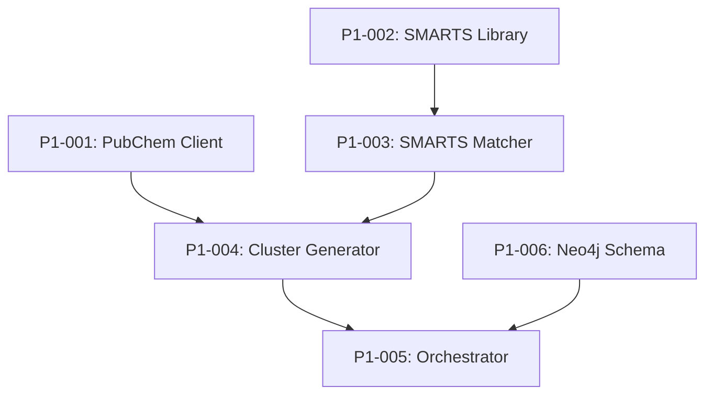

# 🗺️ Phase I: Domain Mapping Backlog

## Overview
Initial "geological survey" of chemical space using PubChem APIs and SMARTS patterns.

**Reference**: `Project Documentation/02_01_Phase_1_Domain Mapping & Definition.md`

---

## Tasks

### P1-001: PubChem API Client
**Priority**: 🔴 Critical | **Estimate**: 4h | **Status**: ⬜ Not Started

**Description**: Implement PubChem PUG REST API client with rate limiting

**Acceptance Criteria**:
- [ ] Async HTTP client with httpx
- [ ] Rate limiting (5 req/sec default)
- [ ] Retry logic with exponential backoff
- [ ] Response caching

**Implementation Notes**:
```python
# src/entrainer_selection/phases/phase_1/pubchem_client.py
class PubChemClient:
    async def search_by_smarts(self, pattern: str) -> List[int]:
        """Search PubChem by SMARTS pattern, return CIDs."""
        pass
    
    async def get_compound_properties(self, cid: int) -> Dict:
        """Get compound properties by CID."""
        pass
```

**Test Approach**: Mock HTTP responses, test rate limiting

---

### P1-002: SMARTS Pattern Library
**Priority**: 🔴 Critical | **Estimate**: 2h | **Status**: ⬜ Not Started

**Description**: Define SMARTS patterns for entrainer functional groups

**Acceptance Criteria**:
- [ ] Patterns for: alcohols, glycols, ethers, esters, ketones, amides
- [ ] Patterns validated with RDKit
- [ ] Documentation of each pattern

**Implementation Notes**:
```python
# Already defined in config/settings.yaml
SMARTS_PATTERNS = {
    "alcohols": "[OX2H]",
    "glycols": "[OX2H]CC[OX2H]",
    "ethers": "[OX2]([CX4])[CX4]",
    # ...
}
```

**Test Approach**: Test each pattern against known molecules

---

### P1-003: SMARTS Matcher
**Priority**: 🔴 Critical | **Estimate**: 3h | **Status**: ⬜ Not Started

**Description**: RDKit-based SMARTS pattern matching

**Acceptance Criteria**:
- [ ] Match molecules against SMARTS patterns
- [ ] Return all matching functional groups
- [ ] Handle invalid SMILES gracefully

**Implementation Notes**:
```python
# src/entrainer_selection/phases/phase_1/smarts_matcher.py
class SMARTSMatcher:
    def match(self, smiles: str) -> List[str]:
        """Return list of matching functional group names."""
        mol = Chem.MolFromSmiles(smiles)
        matches = []
        for name, pattern in self.patterns.items():
            if mol.HasSubstructMatch(Chem.MolFromSmarts(pattern)):
                matches.append(name)
        return matches
```

**Test Approach**: Test with known molecules (ethylene glycol, etc.)

---

### P1-004: Cluster Generator
**Priority**: 🟡 High | **Estimate**: 4h | **Status**: ⬜ Not Started

**Description**: Generate ~500 molecular clusters from PubChem results

**Acceptance Criteria**:
- [ ] Query PubChem for each functional group
- [ ] Deduplicate across groups
- [ ] Create cluster assignments
- [ ] Target ~500 clusters with min 10 molecules each

**Implementation Notes**:
- Use functional group as primary clustering
- Sub-cluster by molecular weight ranges
- Store cluster assignments in Neo4j

**Test Approach**: Verify cluster statistics, no duplicates

---

### P1-005: Domain Mapper Orchestrator
**Priority**: 🟡 High | **Estimate**: 3h | **Status**: ⬜ Not Started

**Description**: Main orchestrator for Phase I

**Acceptance Criteria**:
- [ ] Coordinate all Phase I components
- [ ] Progress reporting
- [ ] Output Phase1Output model
- [ ] Store results in Neo4j

**Implementation Notes**:
```python
# src/entrainer_selection/phases/phase_1/runner.py
class DomainMapper:
    async def run(self) -> Phase1Output:
        # 1. Query PubChem for each SMARTS pattern
        # 2. Match functional groups
        # 3. Generate clusters
        # 4. Store in Neo4j
        # 5. Return Phase1Output
        pass
```

**Test Approach**: Integration test with mocked PubChem

---

### P1-006: Neo4j Schema for Phase I
**Priority**: 🟡 High | **Estimate**: 2h | **Status**: ⬜ Not Started

**Description**: Define Neo4j schema for domain mapping results

**Acceptance Criteria**:
- [ ] Molecule nodes with properties
- [ ] Cluster nodes
- [ ] BELONGS_TO relationships
- [ ] HAS_FUNCTIONAL_GROUP relationships

**Implementation Notes**:
```cypher
// Schema
CREATE CONSTRAINT molecule_smiles IF NOT EXISTS
FOR (m:Molecule) REQUIRE m.smiles IS UNIQUE;

CREATE (m:Molecule {
    smiles: $smiles,
    name: $name,
    cid: $cid,
    molecular_weight: $mw
})

CREATE (c:Cluster {id: $cluster_id, name: $name})
CREATE (m)-[:BELONGS_TO]->(c)
CREATE (m)-[:HAS_FUNCTIONAL_GROUP]->(fg:FunctionalGroup {name: $fg_name})
```

**Test Approach**: Verify schema creation, query performance

---

## Dependencies



---

## Progress
- Total Tasks: 6
- Completed: 0
- In Progress: 0
- Remaining: 6

