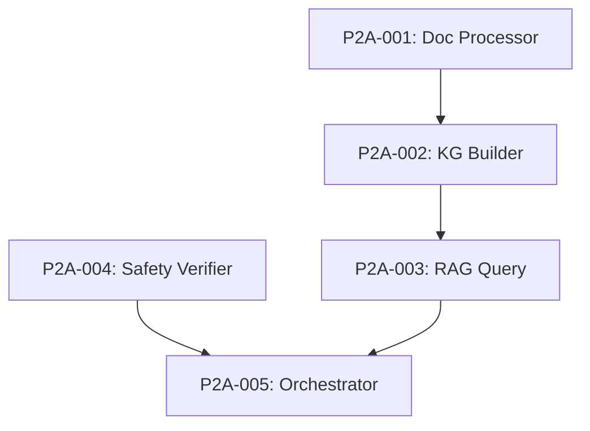

# 📚 Phase II-A: Graph-RAG Engine Backlog

## Overview
Literature-grounded selection using Graph-RAG with Neo4j, ChromaDB, and Gemini.

**Reference**: `Project Documentation/02_02_A_Phase 2-A_Multi-Vector Initial Selection - Engine A Deep Research via Graph-RAG.md`

---

## 🚨 CRITICAL FIX REQUIRED

### P2A-CRITICAL: Safety Data Verification
**Priority**: 🔴 CRITICAL | **Estimate**: 4h | **Status**: ⬜ Not Started

**Problem**: LLMs can hallucinate GHS categories (e.g., Category 3 for a Category 1 chemical)

**Impact**: Safety barrier function in Phase IV fails catastrophically

**Fix Required**:
1. Query PubChem PUG REST API for verified GHS data FIRST
2. Query EPA CompTox API as secondary source
3. Use LLM extraction ONLY as fallback for unstructured text
4. Flag unverified data in SafetyProfile model

**Implementation**:
```python
# src/entrainer_selection/phases/phase_2a/safety_verifier.py
class SafetyVerifier:
    async def get_verified_safety_data(self, cid: int) -> SafetyProfile:
        # 1. Try PubChem PUG REST
        pubchem_data = await self.pubchem_client.get_ghs_data(cid)
        if pubchem_data:
            return SafetyProfile(
                **pubchem_data,
                data_source=DataSource.PUBCHEM,
                verification_status="verified"
            )
        
        # 2. Try CompTox API
        comptox_data = await self.comptox_client.get_safety_data(cid)
        if comptox_data:
            return SafetyProfile(
                **comptox_data,
                data_source=DataSource.COMPTOX,
                verification_status="verified"
            )
        
        # 3. Fallback to LLM (mark as unverified)
        llm_data = await self.llm_extractor.extract_safety(cid)
        return SafetyProfile(
            **llm_data,
            data_source=DataSource.LLM_EXTRACTED,
            verification_status="unverified"
        )
```

---

## Tasks

### P2A-001: Document Processor
**Priority**: 🔴 Critical | **Estimate**: 4h | **Status**: ⬜ Not Started

**Description**: Process literature documents for RAG

**Acceptance Criteria**:
- [ ] PDF/text document loading
- [ ] Chunking with overlap (1000 chars, 200 overlap)
- [ ] Metadata extraction (title, authors, year)
- [ ] Store in ChromaDB

**Test Approach**: Test with sample papers

---

### P2A-002: Knowledge Graph Builder
**Priority**: 🔴 Critical | **Estimate**: 6h | **Status**: ⬜ Not Started

**Description**: Build Neo4j knowledge graph from literature

**Acceptance Criteria**:
- [ ] Extract entities (molecules, properties, applications)
- [ ] Create relationships (MENTIONED_IN, HAS_PROPERTY, USED_FOR)
- [ ] Context-aware properties: `(Molecule)-[:HAS_PROPERTY {context}]->(Property)`
- [ ] Link to ChromaDB chunks

**Implementation Notes**:
```cypher
// Context-aware property storage (CRITICAL FIX)
CREATE (m:Molecule {smiles: $smiles})
CREATE (p:Property {name: $prop_name, value: $value})
CREATE (m)-[:HAS_PROPERTY {
    context: "separation",  // or "pharmaceutical", "industrial"
    source: $source,
    confidence: $confidence
}]->(p)
```

---

### P2A-003: RAG Query Engine
**Priority**: 🟡 High | **Estimate**: 4h | **Status**: ⬜ Not Started

**Description**: Implement RAG query pipeline

**Acceptance Criteria**:
- [ ] Vector similarity search in ChromaDB
- [ ] Graph traversal in Neo4j
- [ ] Combined ranking
- [ ] LLM synthesis of results

---

### P2A-004: Safety Verifier (CRITICAL FIX)
**Priority**: 🔴 CRITICAL | **Estimate**: 4h | **Status**: ⬜ Not Started

**Description**: Implement verified safety data retrieval

**Acceptance Criteria**:
- [ ] PubChem PUG REST API integration
- [ ] EPA CompTox API integration (optional)
- [ ] LLM fallback with "unverified" flag
- [ ] SafetyProfile model updated

---

### P2A-005: Graph-RAG Orchestrator
**Priority**: 🟡 High | **Estimate**: 3h | **Status**: ⬜ Not Started

**Description**: Main orchestrator for Phase II-A

**Acceptance Criteria**:
- [ ] Coordinate document processing
- [ ] Build knowledge graph
- [ ] Query for candidates
- [ ] Verify safety data
- [ ] Output Phase2Output (partial)

---

## Dependencies



---

## Progress
- Total Tasks: 5 (including critical fix)
- Completed: 0
- In Progress: 0
- Remaining: 5

