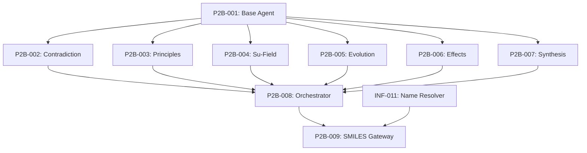

# 🔧 Phase II-B: TRIZ Multi-Agent System Backlog

## Overview
TRIZ methodology applied via 6 specialized LLM agents for innovative entrainer discovery.

**Reference**: `Project Documentation/02_02_B_Phase 2-B_Multi-Vector Initial Selection - Engine B - TRIZ-Powered Consultation Module.md`

---

## Tasks

### P2B-001: Agent Base Class
**Priority**: 🔴 Critical | **Estimate**: 3h | **Status**: ⬜ Not Started

**Description**: Create base class for TRIZ agents

**Acceptance Criteria**:
- [ ] Abstract base with common LLM interface
- [ ] Structured output parsing
- [ ] Conversation history management
- [ ] Error handling and retries

**Implementation Notes**:
```python
# src/entrainer_selection/phases/phase_2b/base_agent.py
class TRIZAgent(ABC):
    def __init__(self, llm_client, role: str, system_prompt: str):
        self.llm = llm_client
        self.role = role
        self.system_prompt = system_prompt
        self.history = []
    
    @abstractmethod
    async def analyze(self, context: Dict) -> AgentOutput:
        pass
```

---

### P2B-002: Contradiction Analyst Agent
**Priority**: 🟡 High | **Estimate**: 3h | **Status**: ⬜ Not Started

**Description**: Agent to identify technical contradictions

**Acceptance Criteria**:
- [ ] Identify contradictions in entrainer selection
- [ ] Map to TRIZ contradiction matrix
- [ ] Output structured contradiction analysis

**Example Contradictions**:
- High selectivity vs. low viscosity
- Low toxicity vs. high boiling point
- Good separation vs. easy recovery

---

### P2B-003: Inventive Principles Expert Agent
**Priority**: 🟡 High | **Estimate**: 3h | **Status**: ⬜ Not Started

**Description**: Agent to apply TRIZ 40 inventive principles

**Acceptance Criteria**:
- [ ] Map contradictions to principles
- [ ] Suggest molecular modifications
- [ ] Rank principles by applicability

**Relevant Principles**:
- #1 Segmentation (functional group modularity)
- #35 Parameter changes (temperature, pressure)
- #40 Composite materials (mixed solvents)

---

### P2B-004: Substance-Field Analyst Agent
**Priority**: 🟡 High | **Estimate**: 3h | **Status**: ⬜ Not Started

**Description**: Agent to model entrainer-mixture interactions

**Acceptance Criteria**:
- [ ] Model Su-Field interactions
- [ ] Identify missing/harmful interactions
- [ ] Suggest field modifications

---

### P2B-005: Evolution Patterns Expert Agent
**Priority**: 🟢 Medium | **Estimate**: 2h | **Status**: ⬜ Not Started

**Description**: Agent to predict technology evolution

**Acceptance Criteria**:
- [ ] Apply TRIZ evolution patterns
- [ ] Predict future entrainer trends
- [ ] Identify innovation opportunities

---

### P2B-006: Effects Database Expert Agent
**Priority**: 🟢 Medium | **Estimate**: 2h | **Status**: ⬜ Not Started

**Description**: Agent to match physical/chemical effects

**Acceptance Criteria**:
- [ ] Query effects database knowledge
- [ ] Match effects to requirements
- [ ] Suggest novel effect combinations

---

### P2B-007: Synthesis Coordinator Agent
**Priority**: 🔴 Critical | **Estimate**: 4h | **Status**: ⬜ Not Started

**Description**: Agent to integrate all agent outputs

**Acceptance Criteria**:
- [ ] Collect outputs from all agents
- [ ] Resolve conflicts
- [ ] Generate consensus recommendations
- [ ] Output candidate molecules

---

### P2B-008: Multi-Agent Orchestrator
**Priority**: 🔴 Critical | **Estimate**: 4h | **Status**: ⬜ Not Started

**Description**: Coordinate multi-agent conversation

**Acceptance Criteria**:
- [ ] Sequential agent execution
- [ ] Context passing between agents
- [ ] Iteration until consensus (max 5)
- [ ] Output Phase2Output (partial)

**Implementation Notes**:
```python
class TRIZAgentSystem:
    async def run(self, seed_molecules: List[str]) -> List[str]:
        context = {"seeds": seed_molecules}
        
        for iteration in range(self.max_iterations):
            # Run each agent
            for agent in self.agents:
                output = await agent.analyze(context)
                context[agent.role] = output
            
            # Check consensus
            if self.coordinator.has_consensus(context):
                break
        
        return self.coordinator.get_candidates(context)
```

---

### P2B-009: SMILES Validation Gateway (CONSULTATION FIX)
**Priority**: 🔴 Critical | **Estimate**: 2h | **Status**: ⬜ Not Started

**Description**: Validate and convert TRIZ agent outputs before passing to Phase 2C

**Acceptance Criteria**:
- [ ] Receive agent recommendations (natural language names/descriptions)
- [ ] Use INF-011 (Name-to-SMILES Resolver) to convert names
- [ ] Validate SMILES strings using RDKit
- [ ] Filter out invalid/unconvertible molecules
- [ ] Output valid MoleculeCandidate objects per schema

**Implementation Notes**:
```python
from rdkit import Chem
from src.core.name_resolver import NameToSMILESResolver
from src.core.schemas import MoleculeCandidate

class SMILESValidationGateway:
    def __init__(self):
        self.resolver = NameToSMILESResolver()

    def process_agent_output(self, agent_recommendations: List[str]) -> List[MoleculeCandidate]:
        valid_candidates = []
        for rec in agent_recommendations:
            smiles = self.resolver.resolve(rec)
            if smiles and self._is_valid_smiles(smiles):
                valid_candidates.append(MoleculeCandidate(
                    smiles=smiles,
                    name=rec,
                    source="triz_agent"
                ))
        return valid_candidates

    def _is_valid_smiles(self, smiles: str) -> bool:
        mol = Chem.MolFromSmiles(smiles)
        return mol is not None
```

**Rationale**: Consultation #7 & #8 identified that LLMs generate names/ideas but Phase 2C requires valid SMILES.

---

## Dependencies



---

## Progress
- Total Tasks: 9
- Completed: 0
- In Progress: 0
- Remaining: 9

---

## 📋 Consultation Feedback Applied

| Recommendation | Task | Status |
|----------------|------|--------|
| Bridge 2B → 2C Data Gap | P2B-009 | ⬜ Added |
| Strict SMILES Validation | P2B-009 | ⬜ Added |

