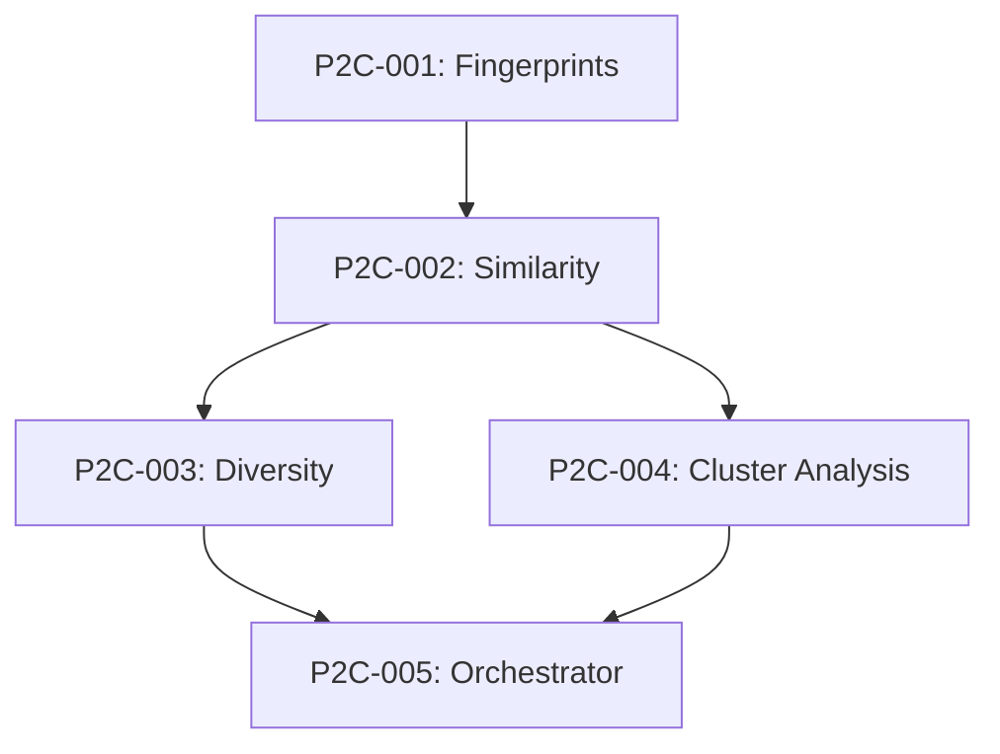

# 🧪 Phase II-C: Cheminformatics & Clustering Backlog

## Overview
RDKit-based molecular analysis and diversity selection.

**Reference**: `Project Documentation/02_02_C_Phase 2-C_Multi-Vector Initial Selection - Engine C - Cheminformatics & Diversity Clustering.md`

---

## 🚨 CRITICAL FIX REQUIRED

### P2C-CRITICAL: Tanimoto Threshold Adjustment
**Priority**: 🔴 CRITICAL | **Estimate**: 2h | **Status**: ⬜ Not Started

**Problem**: Tanimoto coefficient of 0.5 is extremely loose in cheminformatics

**Impact**: Returns molecules that are "somewhat similar" but functionally distinct, flooding the graph with noise

**Fix Required**:
1. Tighten similarity threshold to **0.75-0.85** for "Similarity" edges
2. Keep **0.50** threshold ONLY for "Scaffold Hopping" (exploration)
3. Clearly separate exploitation (high similarity) from exploration (scaffold hopping)

**Implementation**:
```python
# config/settings.yaml - ALREADY UPDATED
diversity:
    tanimoto_similarity_threshold: 0.80  # CRITICAL FIX: Was 0.5
    tanimoto_scaffold_hop_threshold: 0.50  # For exploration only

# src/entrainer_selection/phases/phase_2c/similarity.py
class SimilarityCalculator:
    def get_similar_molecules(self, smiles: str, threshold: float = 0.80):
        """Get similar molecules using TIGHTENED threshold."""
        pass
    
    def get_scaffold_hops(self, smiles: str, threshold: float = 0.50):
        """Get scaffold hops for exploration (looser threshold)."""
        pass
```

---

## Tasks

### P2C-001: Fingerprint Generator
**Priority**: 🔴 Critical | **Estimate**: 3h | **Status**: ⬜ Not Started

**Description**: Generate molecular fingerprints using RDKit

**Acceptance Criteria**:
- [ ] Morgan fingerprints (radius=2, bits=2048)
- [ ] MACCS keys (optional)
- [ ] RDKit fingerprints (optional)
- [ ] Batch processing support

**Implementation Notes**:
```python
# src/entrainer_selection/phases/phase_2c/fingerprints.py
from rdkit import Chem
from rdkit.Chem import AllChem

class FingerprintGenerator:
    def morgan(self, smiles: str) -> np.ndarray:
        mol = Chem.MolFromSmiles(smiles)
        fp = AllChem.GetMorganFingerprintAsBitVect(
            mol, radius=2, nBits=2048
        )
        return np.array(fp)
```

---

### P2C-002: Similarity Calculator (CRITICAL FIX)
**Priority**: 🔴 CRITICAL | **Estimate**: 3h | **Status**: ⬜ Not Started

**Description**: Calculate Tanimoto similarity with CORRECTED thresholds

**Acceptance Criteria**:
- [ ] Tanimoto coefficient calculation
- [ ] Similarity threshold: 0.75-0.85 (CRITICAL FIX)
- [ ] Scaffold hop threshold: 0.50 (separate method)
- [ ] Bulk similarity matrix computation

**Implementation Notes**:
```python
from rdkit import DataStructs

class SimilarityCalculator:
    def __init__(self, similarity_threshold: float = 0.80):
        # CRITICAL FIX: Default 0.80, not 0.50
        self.similarity_threshold = similarity_threshold
        self.scaffold_hop_threshold = 0.50
    
    def tanimoto(self, fp1, fp2) -> float:
        return DataStructs.TanimotoSimilarity(fp1, fp2)
    
    def is_similar(self, fp1, fp2) -> bool:
        """Use TIGHT threshold for similarity."""
        return self.tanimoto(fp1, fp2) >= self.similarity_threshold
    
    def is_scaffold_hop(self, fp1, fp2) -> bool:
        """Use LOOSE threshold for exploration."""
        sim = self.tanimoto(fp1, fp2)
        return self.scaffold_hop_threshold <= sim < self.similarity_threshold
```

---

### P2C-003: Diversity Selector
**Priority**: 🟡 High | **Estimate**: 4h | **Status**: ⬜ Not Started

**Description**: MaxMin diversity selection algorithm

**Acceptance Criteria**:
- [ ] MaxMin algorithm implementation
- [ ] Configurable selection size
- [ ] Diversity score calculation
- [ ] Cluster representative selection

---

### P2C-004: Cluster Analyzer
**Priority**: 🟡 High | **Estimate**: 3h | **Status**: ⬜ Not Started

**Description**: Analyze cluster quality and statistics

**Acceptance Criteria**:
- [ ] Intra-cluster similarity
- [ ] Inter-cluster distance
- [ ] Cluster size distribution
- [ ] Quality metrics

---

### P2C-005: Cheminformatics Orchestrator
**Priority**: 🟡 High | **Estimate**: 3h | **Status**: ⬜ Not Started

**Description**: Main orchestrator for Phase II-C

**Acceptance Criteria**:
- [ ] Generate fingerprints for all molecules
- [ ] Calculate similarity matrix
- [ ] Perform diversity selection
- [ ] Output Phase2Output (partial)

---

## Dependencies



---

## Progress
- Total Tasks: 5 (including critical fix)
- Completed: 0
- In Progress: 0
- Remaining: 5

