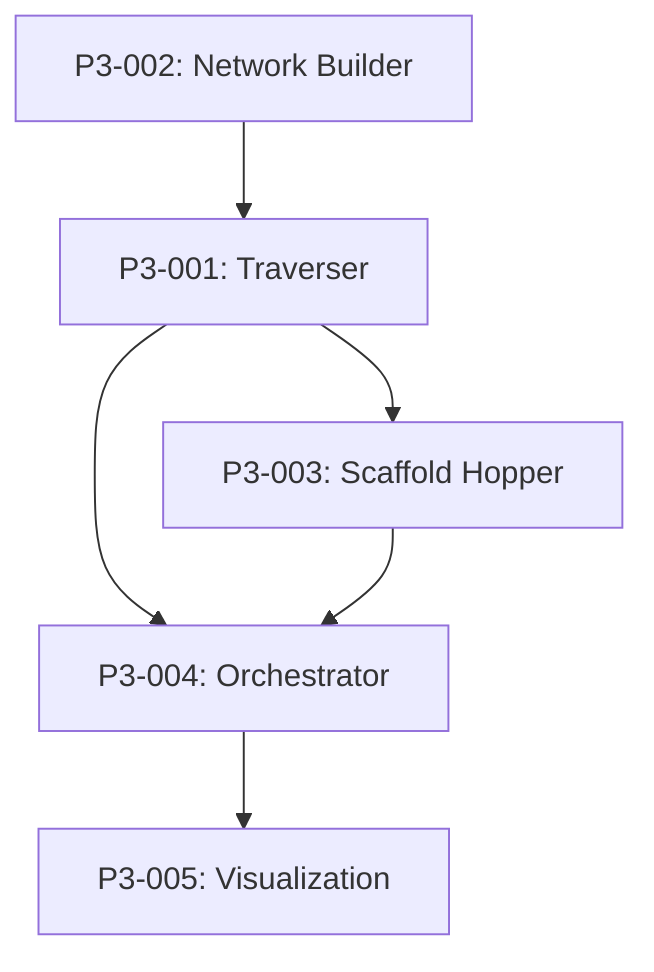

# 🔍 Phase III: Graph Traversal & Expansion Backlog

## Overview
Neo4j-based molecular similarity exploration with BFS traversal.

**Reference**: `Project Documentation/02_03_Phase 3_Graph Traversal & Expansion.md`

---

## 🚨 CRITICAL FIX REQUIRED

### P3-CRITICAL: Similarity Threshold in Traversal
**Priority**: 🔴 CRITICAL | **Estimate**: 2h | **Status**: ⬜ Not Started

**Problem**: Same Tanimoto threshold issue as Phase II-C

**Impact**: Graph traversal returns too many loosely related molecules

**Fix Required**:
1. Use **0.75-0.85** threshold for SIMILAR_TO edges
2. Use **0.50** threshold for SCAFFOLD_HOP edges (separate relationship type)
3. Traversal should prioritize SIMILAR_TO edges, use SCAFFOLD_HOP for exploration

**Implementation**:
```cypher
// Create edges with appropriate thresholds
// SIMILAR_TO: Tanimoto >= 0.75 (exploitation)
MATCH (m1:Molecule), (m2:Molecule)
WHERE m1.smiles <> m2.smiles
AND tanimoto(m1.fingerprint, m2.fingerprint) >= 0.75
CREATE (m1)-[:SIMILAR_TO {similarity: tanimoto(...)}]->(m2)

// SCAFFOLD_HOP: 0.50 <= Tanimoto < 0.75 (exploration)
MATCH (m1:Molecule), (m2:Molecule)
WHERE m1.smiles <> m2.smiles
AND tanimoto(m1.fingerprint, m2.fingerprint) >= 0.50
AND tanimoto(m1.fingerprint, m2.fingerprint) < 0.75
CREATE (m1)-[:SCAFFOLD_HOP {similarity: tanimoto(...)}]->(m2)
```

---

## Tasks

### P3-001: Graph Traverser
**Priority**: 🔴 Critical | **Estimate**: 4h | **Status**: ⬜ Not Started

**Description**: BFS/DFS traversal algorithms for Neo4j

**Acceptance Criteria**:
- [ ] BFS traversal from seed molecules
- [ ] Configurable depth limit
- [ ] Path tracking for explainability
- [ ] Visited node tracking

**Implementation Notes**:
```python
# src/entrainer_selection/phases/phase_3/traverser.py
class GraphTraverser:
    async def bfs(
        self, 
        seeds: List[str], 
        max_depth: int = 3,
        edge_types: List[str] = ["SIMILAR_TO"]
    ) -> List[TraversalPath]:
        query = """
        MATCH path = (seed:Molecule)-[:SIMILAR_TO*1..{depth}]-(target:Molecule)
        WHERE seed.smiles IN $seeds
        RETURN path, length(path) as depth
        ORDER BY depth
        """
        return await self.neo4j.run_query(query, seeds=seeds, depth=max_depth)
```

---

### P3-002: Similarity Network Builder (CRITICAL FIX)
**Priority**: 🔴 CRITICAL | **Estimate**: 4h | **Status**: ⬜ Not Started

**Description**: Build similarity network with CORRECTED thresholds

**Acceptance Criteria**:
- [ ] SIMILAR_TO edges: Tanimoto >= 0.75 (CRITICAL FIX)
- [ ] SCAFFOLD_HOP edges: 0.50 <= Tanimoto < 0.75
- [ ] Batch edge creation
- [ ] Edge weight = similarity score

---

### P3-003: Scaffold Hopper
**Priority**: 🟡 High | **Estimate**: 4h | **Status**: ⬜ Not Started

**Description**: Generate novel structures via scaffold hopping

**Acceptance Criteria**:
- [ ] Identify scaffold cores
- [ ] Generate scaffold variants
- [ ] Filter by drug-likeness
- [ ] Add to graph as SCAFFOLD_HOP edges

---

### P3-004: Expansion Orchestrator
**Priority**: 🟡 High | **Estimate**: 3h | **Status**: ⬜ Not Started

**Description**: Main orchestrator for Phase III

**Acceptance Criteria**:
- [ ] Build similarity network
- [ ] Perform BFS traversal
- [ ] Apply scaffold hopping
- [ ] Output Phase3Output

---

### P3-005: Visualization Export
**Priority**: 🟢 Medium | **Estimate**: 2h | **Status**: ⬜ Not Started

**Description**: Export graph for visualization

**Acceptance Criteria**:
- [ ] Export to GraphML format
- [ ] Export to JSON for web visualization
- [ ] Node coloring by cluster
- [ ] Edge coloring by type (SIMILAR_TO vs SCAFFOLD_HOP)

---

## Dependencies



---

## Progress
- Total Tasks: 5 (including critical fix)
- Completed: 0
- In Progress: 0
- Remaining: 5

