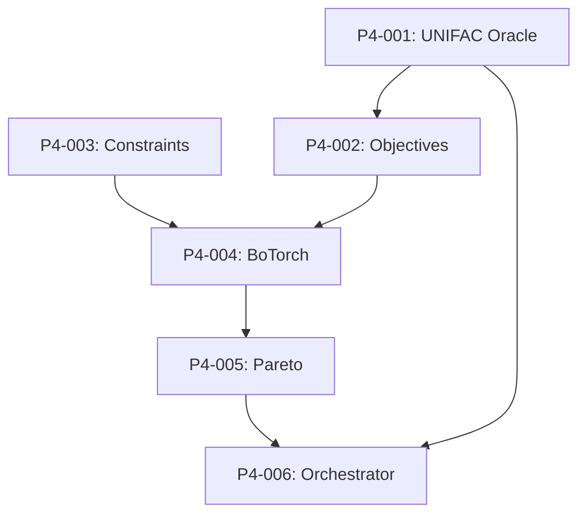

# 📈 Phase IV: Bayesian Optimization Backlog

## Overview
Multi-objective Bayesian optimization using BoTorch for Pareto-optimal entrainer selection.

**Reference**: `Project Documentation/02_04_Phase 4_Multi-Objective Bayesian Optimization.md`

---

## 🚨 CRITICAL FIX REQUIRED

### P4-CRITICAL: Ternary Azeotrope Check in Oracle
**Priority**: 🔴 CRITICAL | **Estimate**: 4h | **Status**: ⬜ Not Started

**Problem**: Solvent may form ternary azeotrope at finite concentrations

**Impact**: Good selectivity at infinite dilution (S∞) but fails in actual column

**Fix Required**:
1. Add ternary azeotrope check in UNIFAC Oracle (Phase IV)
2. If ternary azeotrope exists, set efficiency score = 0
3. Don't wait until Phase V to discover this

**Implementation**:
```python
# src/entrainer_selection/phases/phase_4/oracle.py
class UNIFACOracle:
    def evaluate(self, smiles: str) -> ObjectiveValues:
        # Calculate selectivity at infinite dilution
        selectivity_inf = self.calculate_selectivity_inf(smiles)
        
        # CRITICAL FIX: Check for ternary azeotrope
        forms_ternary = self.check_ternary_azeotrope(smiles)
        
        if forms_ternary:
            # Ternary azeotrope = useless entrainer
            efficiency_score = 0.0
        else:
            efficiency_score = self.normalize_selectivity(selectivity_inf)
        
        return ObjectiveValues(
            efficiency=efficiency_score,
            safety=self.calculate_safety_score(smiles),
            cost=self.calculate_cost_score(smiles),
            forms_ternary_azeotrope=forms_ternary
        )
    
    def check_ternary_azeotrope(self, smiles: str) -> bool:
        """
        Check if entrainer forms ternary azeotrope with ethanol-water.
        
        Uses UNIFAC to calculate VLE at various compositions.
        If y_i = x_i for all components at any composition, ternary azeotrope exists.
        """
        # Implementation using UNIFAC VLE calculations
        pass
```

---

## Tasks

### P4-001: UNIFAC Oracle
**Priority**: 🔴 Critical | **Estimate**: 6h | **Status**: ⬜ Not Started

**Description**: Property estimation using UNIFAC

**Acceptance Criteria**:
- [ ] Activity coefficient calculation (γ∞)
- [ ] Selectivity calculation (S∞ = γ_water∞ / γ_ethanol∞)
- [ ] Ternary azeotrope check (CRITICAL FIX)
- [ ] Capacity calculation

**Implementation Notes**:
- Use thermo library for UNIFAC calculations
- Cache results for repeated queries

---

### P4-002: Objective Calculator
**Priority**: 🔴 Critical | **Estimate**: 4h | **Status**: ⬜ Not Started

**Description**: Calculate multi-objective scores

**Acceptance Criteria**:
- [ ] Efficiency score (0-1, from selectivity)
- [ ] Safety score (0-1, from GHS data)
- [ ] Cost score (0-1, from availability/price)
- [ ] Normalization to [0, 1] range

---

### P4-003: Constraint Handler
**Priority**: 🔴 Critical | **Estimate**: 3h | **Status**: ⬜ Not Started

**Description**: Safety barrier constraints

**Acceptance Criteria**:
- [ ] Hard constraints (Category 1 toxicity = reject)
- [ ] Soft constraints (penalty functions)
- [ ] Constraint satisfaction check
- [ ] Uses VERIFIED safety data only

---

### P4-004: BoTorch MOBO Setup
**Priority**: 🔴 Critical | **Estimate**: 6h | **Status**: ⬜ Not Started

**Description**: Configure BoTorch multi-objective optimization

**Acceptance Criteria**:
- [ ] qEHVI acquisition function
- [ ] GP surrogate model
- [ ] Reference point configuration
- [ ] Batch acquisition

**Implementation Notes**:
```python
from botorch.acquisition.multi_objective import qExpectedHypervolumeImprovement
from botorch.models import SingleTaskGP

class MOBOOptimizer:
    def __init__(self, ref_point: List[float]):
        self.ref_point = ref_point  # [0, 0, 0] for minimization
        self.model = None
        self.acq_func = None
    
    def fit_model(self, X: Tensor, Y: Tensor):
        self.model = SingleTaskGP(X, Y)
        self.acq_func = qExpectedHypervolumeImprovement(
            model=self.model,
            ref_point=self.ref_point,
        )
```

---

### P4-005: Pareto Analyzer
**Priority**: 🟡 High | **Estimate**: 3h | **Status**: ⬜ Not Started

**Description**: Analyze Pareto frontier

**Acceptance Criteria**:
- [ ] Identify Pareto-optimal points
- [ ] Calculate hypervolume
- [ ] Find knee point
- [ ] Rank by distance to ideal

---

### P4-006: Optimization Orchestrator
**Priority**: 🟡 High | **Estimate**: 4h | **Status**: ⬜ Not Started

**Description**: Main orchestrator for Phase IV

**Acceptance Criteria**:
- [ ] Initialize with Phase III candidates
- [ ] Run optimization loop
- [ ] Select top 10 for Phase V
- [ ] Output Phase4Output

---

## Dependencies



---

## Progress
- Total Tasks: 6 (including critical fix)
- Completed: 0
- In Progress: 0
- Remaining: 6

