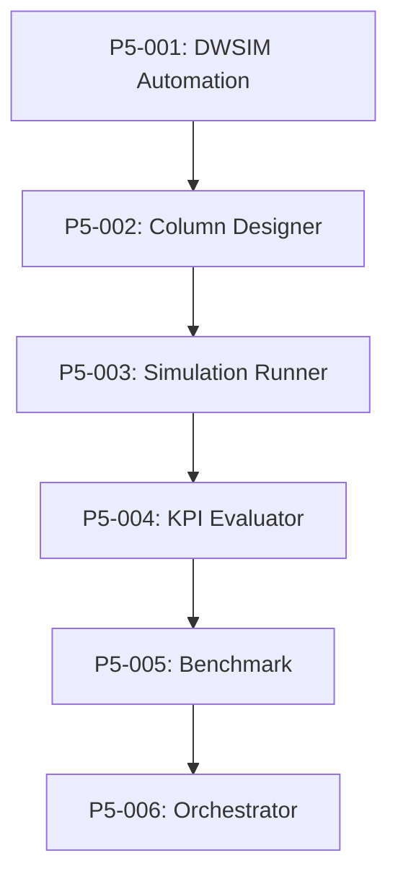

# 🔬 Phase V: Process Simulation Backlog

## Overview
DWSIM-based rigorous process simulation for final validation.

**Reference**: `Project Documentation/02_05_Phase 5_Process Simulation & Validation.md`

---

## 📋 Risk Assessment

**DWSIM Risk is CONTAINED to Phase 5.** It does NOT impact Phases 1-4.

| Concern | Reality |
|---------|---------|
| "If DWSIM fails, all work is wasted" | ❌ FALSE - Phases 1-4 produce valid ranked candidates |
| "Must validate DWSIM before starting" | ❌ FALSE - Can proceed and handle in Phase 5 |
| "No fallback options" | ❌ FALSE - Multiple Plan-B options available |

**Phases 1-4 Output:** Ranked list of top 10 candidate entrainers (valuable regardless of Phase 5)
**Phase 5 Output:** Rigorous simulation validation of those candidates

---

## 🚨 CRITICAL FIX REQUIRED

### P5-CRITICAL: Use DWSIM, NOT Fenske-Underwood-Gilliland
**Priority**: 🔴 CRITICAL | **Estimate**: 8h | **Status**: ⬜ Not Started

**Problem**: FUG shortcut method assumes constant relative volatility

**Impact**: INVALID for extractive distillation where entrainer changes α along column

**Why FUG Fails**:
1. FUG assumes α is constant from top to bottom
2. In extractive distillation, entrainer concentration varies along column
3. α changes dramatically with entrainer concentration
4. FUG will give WRONG number of stages and reflux ratio

**Fix Required**:
1. Use DWSIM COM automation to solve full MESH equations
2. MESH = Material balance, Equilibrium, Summation, Heat balance
3. VLE calculated at EVERY stage with actual compositions
4. Verify azeotrope is actually broken at each stage

**Implementation**:
```python
# src/entrainer_selection/phases/phase_5/dwsim_automation.py
import win32com.client

class DWSIMAutomation:
    def __init__(self):
        self.dwsim = win32com.client.Dispatch("DWSIM.Automation.Automation")
    
    def simulate_extractive_distillation(
        self,
        entrainer_smiles: str,
        feed_composition: Dict[str, float],
        column_specs: ColumnSpecs
    ) -> SimulationResult:
        """
        Run rigorous MESH simulation in DWSIM.
        
        CRITICAL: This solves full MESH equations at every stage,
        NOT the FUG shortcut which assumes constant α.
        """
        # 1. Create flowsheet
        flowsheet = self.dwsim.CreateFlowsheet()
        
        # 2. Add components (ethanol, water, entrainer)
        self._add_components(flowsheet, entrainer_smiles)
        
        # 3. Configure thermodynamic model (NRTL or UNIQUAC)
        self._configure_thermo(flowsheet, "NRTL")
        
        # 4. Add extractive distillation column
        column = self._add_column(flowsheet, column_specs)
        
        # 5. Run simulation (solves MESH at every stage)
        flowsheet.Solve()
        
        # 6. Extract results
        return self._extract_results(flowsheet, column)
```

---

## Tasks

### P5-001: DWSIM COM Automation (CRITICAL FIX)
**Priority**: 🔴 CRITICAL | **Estimate**: 8h | **Status**: ⬜ Not Started

**Description**: Implement DWSIM COM automation interface

**Acceptance Criteria**:
- [ ] Connect to DWSIM via COM
- [ ] Create flowsheets programmatically
- [ ] Add components and configure thermodynamics
- [ ] Run simulations and extract results

**Prerequisites**:
- DWSIM installed (free, open-source)
- Windows OS (COM automation)
- pywin32 package

---

### P5-002: Column Designer
**Priority**: 🔴 Critical | **Estimate**: 4h | **Status**: ⬜ Not Started

**Description**: Generate column specifications

**Acceptance Criteria**:
- [ ] Extractive column specs (stages, feeds, S/F ratio)
- [ ] Recovery column specs
- [ ] Initial estimates for convergence
- [ ] Constraint validation

---

### P5-003: Simulation Runner
**Priority**: 🔴 Critical | **Estimate**: 4h | **Status**: ⬜ Not Started

**Description**: Batch simulation executor

**Acceptance Criteria**:
- [ ] Run simulations for top 10 candidates
- [ ] Parallel execution (if possible)
- [ ] Error handling and retries
- [ ] Progress reporting

---

### P5-004: KPI Evaluator
**Priority**: 🟡 High | **Estimate**: 3h | **Status**: ⬜ Not Started

**Description**: Calculate performance metrics

**Acceptance Criteria**:
- [ ] Ethanol purity (target: 99.5%)
- [ ] Ethanol recovery (target: 99%)
- [ ] Energy consumption (reboiler duty)
- [ ] Entrainer makeup rate

---

### P5-005: Benchmark Comparator
**Priority**: 🟡 High | **Estimate**: 3h | **Status**: ⬜ Not Started

**Description**: Compare with ethylene glycol benchmark

**Acceptance Criteria**:
- [ ] Run benchmark simulation with EG
- [ ] Calculate relative performance
- [ ] Generate comparison report
- [ ] Identify improvements

---

### P5-006: Simulation Orchestrator
**Priority**: 🟡 High | **Estimate**: 4h | **Status**: ⬜ Not Started

**Description**: Main orchestrator for Phase V

**Acceptance Criteria**:
- [ ] Run simulations for all candidates
- [ ] Evaluate KPIs
- [ ] Compare with benchmark
- [ ] Generate final ranking
- [ ] Output Phase5Output

---

## Dependencies



---

---

### P5-007: Solver Strategy Pattern (CONSULTATION FIX)
**Priority**: 🟡 High | **Estimate**: 2h | **Status**: ⬜ Not Started

**Description**: Implement fallback solver logic for convergence failures

**Acceptance Criteria**:
- [ ] If Newton-Raphson fails, switch to Inside-Out
- [ ] If convergence oscillates, auto-increase damping factor
- [ ] Log solver switches for debugging
- [ ] Return graceful failure if all solvers fail

**Implementation Notes**:
```python
class SolverStrategy:
    SOLVERS = ["Newton-Raphson", "Inside-Out", "Sum-Rates"]

    def run_with_fallback(self, simulation):
        for solver in self.SOLVERS:
            try:
                simulation.set_solver(solver)
                result = simulation.solve()
                if result.converged:
                    return result
            except ConvergenceError:
                continue
        return SimulationResult(converged=False, reason="All solvers failed")
```

**Rationale**: Consultation #8 recommended fallback logic for DWSIM convergence issues.

---

## Alternative: Aspen Plus Automation

If DWSIM is not available, Aspen Plus can be used:

```python
# Alternative using Aspen Plus COM
class AspenAutomation:
    def __init__(self):
        self.aspen = win32com.client.Dispatch("Apwn.Document")
```

Note: Aspen Plus requires license.

---

## 🅱️ PLAN-B: Fallback Options if DWSIM COM Fails

If DWSIM COM automation proves too brittle, here are fallback strategies ranked by recommendation:

### Option 1: Manual DWSIM GUI (RECOMMENDED FALLBACK)
**Effort:** Low | **Rigor:** ✅ High | **Automation:** ❌ Manual

```
For top 10 candidates from Phase 4:
  1. Open DWSIM GUI
  2. Load extractive distillation template
  3. Input entrainer properties manually
  4. Run simulation
  5. Record results

Estimated time: 30 min × 10 candidates = 5 hours total
```

**Pros:** Same rigorous MESH calculations, no automation headaches
**Cons:** Manual effort, not reproducible without documentation

---

### Option 2: DWSIM Command Line Interface (CLI)
**Effort:** Medium | **Rigor:** ✅ High | **Automation:** ✅ Cross-platform

```python
# Uses DWSIM's Mono-based CLI instead of COM
import subprocess

def run_dwsim_cli(flowsheet_path: str, output_path: str):
    result = subprocess.run([
        "mono", "/path/to/DWSIM.CLI.exe",
        "--flowsheet", flowsheet_path,
        "--output", output_path
    ], capture_output=True)
    return result.returncode == 0
```

**Pros:** Cross-platform (Linux/Mac/Windows), scriptable
**Cons:** Requires Mono runtime, less documented than COM

---

### Option 3: ChemSep / COCO Simulator
**Effort:** Medium | **Rigor:** ✅ High | **Automation:** ✅ Full

```
ChemSep: Free, open-source column simulator
COCO: Cape-Open to Cape-Open simulation environment

Both support:
- Extractive distillation columns
- NRTL/UNIQUAC thermodynamics
- Python automation via CAPE-OPEN interface
```

**Pros:** Designed for distillation, good Python support
**Cons:** Different API to learn, may need template conversion

---

### Option 4: Shortcut FUG Method (LAST RESORT)
**Effort:** Low | **Rigor:** ⚠️ Approximate | **Automation:** ✅ Full

```python
# Fenske-Underwood-Gilliland shortcut
# WARNING: Assumes constant relative volatility (approximate for extractive dist.)

def fug_shortcut(alpha_avg: float, x_d: float, x_b: float, q: float):
    # Fenske minimum stages
    N_min = log((x_d/(1-x_d)) * ((1-x_b)/x_b)) / log(alpha_avg)
    # Underwood minimum reflux
    # Gilliland correlation for actual stages
    return N_actual, R_actual
```

**Pros:** Fast, fully automated, no external dependencies
**Cons:** Assumes constant α (INVALID for extractive distillation - use only for rough screening)

---

### Decision Matrix

| Scenario | Recommended Option |
|----------|-------------------|
| DWSIM COM works perfectly | Use P5-001 as designed |
| DWSIM COM is brittle/unreliable | Option 2: CLI |
| Need cross-platform deployment | Option 2: CLI or Option 3: ChemSep |
| Time pressure, just need results | Option 1: Manual GUI |
| Rough screening only | Option 4: FUG (with caveats) |

---

## ⚠️ Docker vs. Windows Deployment Decision

**Note:** This decision can be deferred until Phase 5 implementation.

The project mentions "Dockerized Virtual Lab" but DWSIM COM requires Windows.

**Resolution Options:**
1. **Abandon Docker** - Use Windows Host only (simplest)
2. **DWSIM CLI** - Use cross-platform command line interface (Mono-based)
3. **REST Service** - Deploy DWSIM on Windows VM, communicate via HTTP/REST
4. **Windows Container** - Use Windows Docker container (limited support)

**Recommendation:** Try DWSIM COM first. If it fails, fall back to CLI or manual.

---

## Progress
- Total Tasks: 7 (including critical fix and solver strategy)
- Completed: 0
- In Progress: 0
- Remaining: 7

---

## 📋 Consultation Feedback Applied

| Recommendation | Task | Status |
|----------------|------|--------|
| DWSIM Feasibility Test | INF-009 (prerequisite) | ⬜ Cross-ref |
| Solver Strategy Pattern | P5-007 | ⬜ Added |
| Simulation Watchdog | INF-012 (prerequisite) | ⬜ Cross-ref |
| Docker vs COM Decision | ⚠️ Section Added | Pending Decision |

